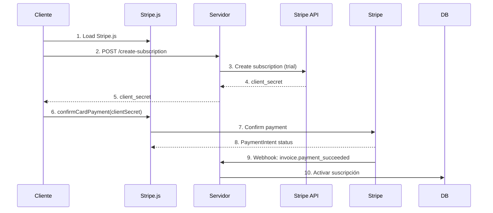

# Stripe — Infraestructura de Pagos para Internet

## Visión General

Stripe fue fundada en 2010 por Patrick y John Collison. Procesa pagos en más de 135 monedas y ofrece una plataforma completa que incluye checkout alojado, facturación recurrente, mercado (Connect), prevención de fraude (Radar), emisión de tarjetas (Issuing) y capital (Treasury). Stripe es conocida por su API limpia y su modelo de precios transparente.

## Arquitectura Técnica

```
┌──────────────────────────────────────────────────┐
│              Cliente (Browser / App)              │
│  Stripe.js · Elements · Payment Request Button   │
├──────────────────────────────────────────────────┤
│              Stripe API Gateway                    │
│  /v1/charges · /v1/payment_intents · /v1/checkout│
├──────────────────────────────────────────────────┤
│           Stripe Core (Procesamiento)             │
│  Auth · Captura · Liquidación · Conciliación      │
├──────────────────────────────────────────────────┤
│         Redes de Pago (Adquirentes)               │
│  Visa · Mastercard · AMEX · SEPA · ACH · etc     │
└──────────────────────────────────────────────────┘
```

## Modelo de Pagos en Stripe

### PaymentIntent — El núcleo del pago moderno

Stripe recomendó migrar de Charges/ Sources a PaymentIntents en 2019. Este modelo maneja todo el ciclo de vida del pago.

```
PaymentIntent (pi_xxx)
  ├── amount: 5000 (cents, es decir 50.00 EUR)
  ├── currency: eur
  ├── status: requires_payment_method | requires_confirmation | requires_action | processing | succeeded | canceled
  ├── customer: cus_xxx (opcional)
  ├── payment_method: pm_xxx
  ├── metadata: {"order_id": "12345", "proyecto": "migracion-cloud"}
  └── charges: [ch_xxx] (transacción en adquirente)
```

```python
import stripe
stripe.api_key = "sk_live_..."

# Crear PaymentIntent para un pago único
intent = stripe.PaymentIntent.create(
    amount=5000,        # 50.00 EUR en cents
    currency="eur",
    metadata={
        "order_id": "ORD-2025-001",
        "customer_email": "cliente@empresa.com"
    },
    description="Pago del proyecto Migración Cloud",
    capture_method="automatic",
    payment_method_types=["card", "ideal", "sofort"],
    statement_descriptor="MIGRACION CLOUD"
)

print(f"PaymentIntent creado: {intent.id}, status: {intent.status}")
```

## Stripe.js — Frontend Seguro

```html
<!DOCTYPE html>
<html>
<head>
  <script src="https://js.stripe.com/v3/"></script>
</head>
<body>
  <form id="payment-form">
    <div id="card-element"><!-- Stripe Elements inyecta el iframe aquí --></div>
    <div id="card-errors" role="alert"></div>
    <button id="submit-btn">Pagar 50.00 EUR</button>
  </form>

  <script>
    const stripe = Stripe('pk_live_...');
    const elements = stripe.elements();
    const cardElement = elements.create('card', {
      style: {
        base: {
          fontSize: '16px',
          fontFamily: '"Inter", sans-serif',
          '::placeholder': { color: '#aab7c4' }
        }
      }
    });
    cardElement.mount('#card-element');

    const form = document.getElementById('payment-form');
    form.addEventListener('submit', async (e) => {
      e.preventDefault();

      // 1. Solicitar PaymentIntent al servidor
      const response = await fetch('/api/create-payment-intent', {
        method: 'POST',
        headers: { 'Content-Type': 'application/json' },
        body: JSON.stringify({ amount: 5000, currency: 'eur' })
      });
      const { clientSecret } = await response.json();

      // 2. Confirmar el pago en el frontend
      const { paymentIntent, error } = await stripe.confirmCardPayment(
        clientSecret,
        { payment_method: { card: cardElement } }
      );

      if (error) {
        document.getElementById('card-errors').textContent = error.message;
      } else if (paymentIntent.status === 'succeeded') {
        window.location.href = '/success?payment_intent=' + paymentIntent.id;
      }
    });
  </script>
</body>
</html>
```

## Webhooks de Stripe

```python
import stripe
from flask import Flask, request, jsonify

app = Flask(__name__)
stripe.api_key = "sk_live_..."
WH_SECRET = "whsec_..."

@app.route("/webhooks/stripe", methods=["POST"])
def stripe_webhook():
    payload = request.get_data(as_text=True)
    sig_header = request.headers.get("Stripe-Signature")

    try:
        event = stripe.Webhook.construct_event(payload, sig_header, WH_SECRET)
    except ValueError:
        return "Invalid payload", 400
    except stripe.error.SignatureVerificationError:
        return "Invalid signature", 400

    # Manejar eventos
    match event["type"]:
        case "payment_intent.succeeded":
            pi = event["data"]["object"]
            handle_successful_payment(pi)
        case "payment_intent.payment_failed":
            pi = event["data"]["object"]
            handle_failed_payment(pi)
        case "charge.refunded":
            charge = event["data"]["object"]
            handle_refund(charge)
        case "customer.subscription.updated":
            sub = event["data"]["object"]
            handle_subscription_update(sub)
        case "account.updated":
            handle_account_update(event["data"]["object"])
        case _:
            print(f"Evento no manejado: {event['type']}")

    return jsonify({"status": "ok"})

def handle_successful_payment(pi):
    order_id = pi["metadata"].get("order_id")
    print(f"Pago exitoso: {pi['id']}, pedido: {order_id}")
    # Actualizar estado del pedido en la base de datos
    # Enviar email de confirmación
    # Actualizar inventario
```

## Stripe Connect — Marketplace

Stripe Connect permite plataformas que procesan pagos en nombre de terceros (vendedores, freelancers, etc.).

```python
import stripe

# 1. Crear una cuenta conectada (vendedor)
account = stripe.Account.create(
    type="express",
    country="ES",
    email="vendedor@tienda.com",
    capabilities={
        "transfers": {"requested": True},
    },
    business_type="individual",
    business_profile={
        "url": "https://tienda-vendedor.com",
        "product_description": "Venta de productos digitales"
    },
    tos_acceptance={
        "date": int(time.time()),
        "ip": request.remote_addr
    }
)

# 2. Pago con split (plataforma cobra comisión)
payment_intent = stripe.PaymentIntent.create(
    amount=10000,  # 100.00 EUR
    currency="eur",
    application_fee_amount=1500,  # 15.00 EUR comisión
    transfer_data={
        "destination": account.id,  # cuenta del vendedor
    },
    metadata={
        "seller_id": account.id,
        "product": "curso-online"
    }
)

# 3. Pago directo a la cuenta conectada
transfer = stripe.Transfer.create(
    amount=5000,
    currency="eur",
    destination=account.id,
    transfer_group="ORDER_12345",
    metadata={
        "description": "Pago por servicios de consultoría"
    }
)
```

## Stripe Billing — Suscripciones

```python
# 1. Crear producto y precio
product = stripe.Product.create(name="Plan Profesional Mensual")

price = stripe.Price.create(
    product=product.id,
    unit_amount=2999,  # 29.99 EUR
    currency="eur",
    recurring={"interval": "month", "interval_count": 1}
)

# 2. Crear suscripción para un cliente
subscription = stripe.Subscription.create(
    customer="cus_xxx",
    items=[{"price": price.id}],
    payment_settings={
        "payment_method_types": ["card", "sepa_debit"],
    },
    collection_method="charge_automatically",
    metadata={
        "client_id": "CLI-001",
        "plan": "profesional"
    },
    trial_period_days=14,
    off_session=True,
    payment_behavior="default_incomplete"
)

# 3. Factura programada o bajo demanda
invoice = stripe.Invoice.create(
    customer="cus_xxx",
    auto_advance=True,
    collection_method="charge_automatically",
    pending_invoice_items_behavior="include"
)
invoice = stripe.Invoice.finalize_invoice(invoice.id)
invoice.pay(invoice.id)

# 4. Cancelar suscripción
stripe.Subscription.modify(
    "sub_xxx",
    cancel_at_period_end=True
)
```

## Stripe Radar — Prevención de Fraude

```python
# Reglas personalizadas de Radar
stripe.Radar.Rule.create(
    name="Bloquear VPN de alta riesgo",
    conditions=[
        {"field": "card_country", "operator": "not_equal", "value": "billing_country"},
        {"field": "is_vpn", "operator": "equals", "value": True},
        {"field": "risk_score", "operator": "greater_than", "value": 70}
    ],
    actions=["block"],
    description="Bloquea transacciones desde VPN con score > 70"
)

# También se pueden usar Rules Engine via Dashboard
# Evaluación manual de riesgo
payment_intent = stripe.PaymentIntent.retrieve("pi_xxx")
risk = payment_intent.radar.risk_level  # normal | elevated | highest
score = payment_intent.radar.score  # 0-100

if risk == "highest":
    send_for_manual_review(payment_intent)
```

## Reportes y Conciliación

```python
# Reportes de balance
balance_transactions = stripe.BalanceTransaction.list(
    limit=100,
    created={"gte": start_of_month},
    type="payment"
)

for txn in balance_transactions:
    print(f"{txn.id}: {txn.amount / 100} {txn.currency.upper()} "
          f"- Fee: {txn.fee / 100} - Net: {txn.net / 100}")

# Reportes de disputas
disputes = stripe.Dispute.list(limit=50)
for dispute in disputes:
    print(f"Disputa {dispute.id}: {dispute.amount / 100} {dispute.currency} "
          f"- Razón: {dispute.reason} - Status: {dispute.status}")
```

## CLI de Stripe

```bash
# Instalación
brew install stripe/stripe-cli/stripe

# Login
stripe login

# Reenviar webhooks a localhost
stripe listen --forward-to https://localhost:5000/webhooks/stripe

# Disparar eventos de prueba
stripe trigger payment_intent.succeeded
stripe trigger customer.subscription.updated

# Pagos de prueba
stripe charges create --amount=5000 --currency=eur \
  --source=tok_visa

# Ver logs de API
stripe logs tail

# Configuración de webhook endpoint
stripe endpoints create \
  --display-name "Mi Webhook" \
  --events "payment_intent.succeeded,charge.refunded" \
  --url "https://api.miservicio.com/webhooks/stripe"
```

## Buenas Prácticas

1. **Idempotencia** — Usar `idempotency_key` para evitar duplicados en reintentos.
2. **Información sensible** — Nunca enviar el `secret_key` al frontend; usar `publishable_key` y siempre confirmar pagos del lado del servidor.
3. **Webhooks** — Responder rápido (200 OK) y procesar eventos asíncronamente. Verificar firma HMAC siempre.
4. **Test mode** — Usar claves de test (`sk_test_...`) en desarrollo con tarjetas de prueba (`4242 4242 4242 4242`).
5. **Tokenización** — Stripe.js tokeniza tarjetas antes de que toquen tu servidor (PCI-DSS SAQ A).
6. **SCA** — Para Europa, manejar autenticación fuerte (3D Secure) con `requires_action`.
7. **Monitoring** — Monitorear tasas de éxito, decline codes (`insufficient_funds`, `do_not_honor`) y disputas.
8. **Expansion** — Usar `?expand[]=customer` para evitar requests adicionales.
9. **Metadata** — Usar metadata para enriquecer eventos de webhook con datos de negocio.

## Pagos Recurrentes — Esquema de Integración


